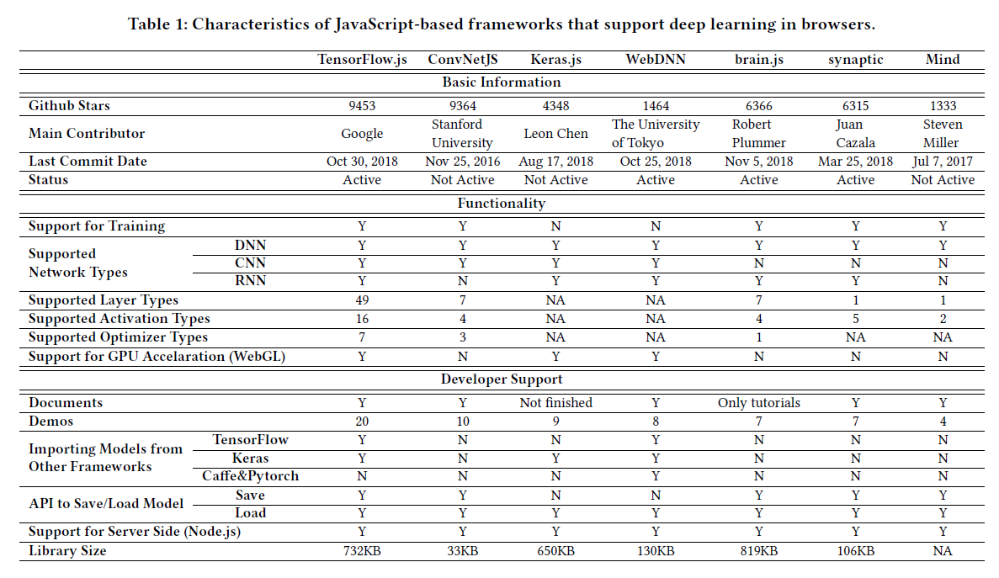
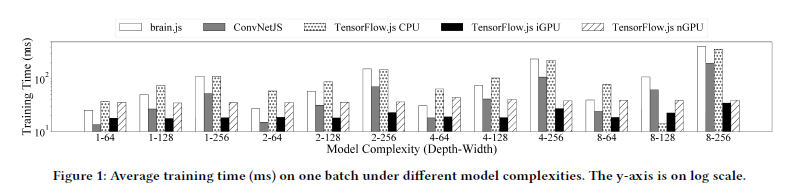

# Moving Deep Learning into Web Browser  How Far Can We Go? 🐾 

  

Table 1. summarizes all the results as of Nov. 2018.[11]

  

****

 

  

  
  
  

# jsFlow
a Lightweight Web Browser-based Machine Learning Framework

 

  

# Reference

[1] 2020. brain.js. https://github.com/BrainJS.

[2] 2020. Apache Singa. https://singa.apache.org

[3] 2020. Apache Mahout. https://mahout.apache.org

[4] 2020. Microsoft Cognitive Toolkit. https://docs.microsoft.com/en-us/cognitive-toolkit/

[5] 2020. Keras.js. https://github.com/transcranial/keras-js.

[6] 2020. TensorFlow.js. https://www.tensorflow.org/js/

[7] 2020. TensorFlow.js Application Case. https://mp.weixin.qq.com/mp/appmsgalbum?biz=MzU1OTMyNDcxMQ==&action=getalbum&album_id=1338140687686254592 (in Chinese)

[8] 2020. MIL WebDNN Benchmark. https://mil-tokyo.github.io/webdnn/#benchmar.

[9] 2020. Mind. https://github.com/stevenmiller888/mind.

[10] 2020. MorphCast. https://www.morphcast.com/.

[11] Ma, Yun & Xiang, Dongwei & Zheng, Shuyu & Tian, Deyu & Liu, Xuanzhe. (2019). Moving Deep Learning into Web Browser: How Far Can We Go?. https://arxiv.org/pdf/1901.09388.pdf

[12] ConvNetJS Deep Learning in your browser https://cs.stanford.edu/people/karpathy/convnetjs/

[13] ConvNetJS. https://github.com/karpathy/convnetjs

[14] The Best AI & Machine Learning Frameworks to Learn for Web Development https://www.freecodecamp.org/news/best-ai-machine-learning-frameworks-for-web-development/

[15] Building a Web Application to Deploy Machine Learning Models https://towardsdatascience.com/building-a-web-application-to-deploy-machine-learning-models-e224269c1331

[16] Top 5 Machine Learning Frameworks For Web Development https://dzone.com/articles/top-machine-learning-frameworks-for-web-developmen

[17] Embedding Machine Learning Models to Web Apps (Part-1) https://towardsdatascience.com/embedding-machine-learning-models-to-web-apps-part-1-6ab7b55ee428

[18] Xavier Bourry, Kai Sasaki, Christoph Körner, Reiichiro Nakano. 2018. Deep Learning in the Browser. ISBN 978-1-939902-54-2.

[19] Tengine. https://github.com/OAID/Tengine

[20] NanoDet. RangiLyu. GitHub repository. https://github.com/RangiLyu/nanodet  [📑[paper]() | [code](https://github.com/RangiLyu/nanodet) | 🍅[demo](https://nihui.github.io/ncnn-webassembly-nanodet/)]
